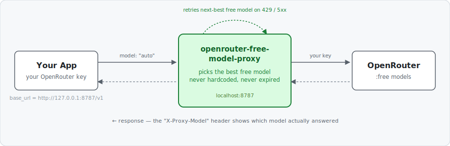

# openrouter-free-model-proxy

**The point of this project:** you should never have to hardcode a specific free OpenRouter model. Free (`:free`) models get rate-limited without warning, and they expire on schedules you'd otherwise have to track by hand — hardcode one and your app eventually just breaks. This proxy makes that entirely someone else's problem: point your app at it, send `model: "auto"`, and it always hands you a currently-healthy free model — re-ranking automatically as the catalogue changes, and falling back instantly if the one it picked fails mid-request. No model names to update, no expiration dates to watch.

It's a small local, OpenAI-compatible proxy. Any app in any language can use it — you keep using your own OpenRouter key, you just change the `base_url`.



## How it works

1. Fetches OpenRouter's live `:free` catalogue and its real-world usage ranking.
2. Filters out models that are expiring soon, have poor uptime, or train on your prompts (see [privacy tiers](#privacy-tiers) below).
3. Caches the ranked result (rebuilt every `ttl_seconds`, refreshed in the background so requests never block on it).
4. On each request, tries the top-ranked model; if it 429s or errors, retries the next-best instantly — no manual intervention, no restart.

## Install

One line (clones to `~/openrouter-free-model-proxy`, runs it as a background service):

```bash
curl -fsSL https://raw.githubusercontent.com/GoSlowPoke168/openrouter-free-model-proxy/main/install.sh | bash
```

Or manually:

```bash
git clone https://github.com/GoSlowPoke168/openrouter-free-model-proxy
cd openrouter-free-model-proxy
python3 -m venv venv && ./venv/bin/pip install -r requirements.txt
./run_proxy.sh                 # foreground, or:
./install_service.sh           # background systemd --user service (survives logout)
```

Requires `python3` + `git`. Only dependency: `requests`. Set `NO_SERVICE=1` before the one-liner to skip the service.

## Use

Point your client at the proxy and send `model: "auto"`:

```python
from openai import OpenAI
client = OpenAI(base_url="http://127.0.0.1:8787/v1", api_key="<your OpenRouter key>")
client.chat.completions.create(model="auto", messages=[{"role":"user","content":"hi"}])
```

```bash
curl http://127.0.0.1:8787/v1/chat/completions \
  -H "Authorization: Bearer $OPENROUTER_API_KEY" \
  -d '{"model":"auto","messages":[{"role":"user","content":"hi"}]}'
```

The proxy forwards your key straight to OpenRouter (it stores nothing and never logs your key). Add `"stream": true` for token streaming. The response header `X-Proxy-Model` tells you which model actually answered (`X-Proxy-Fallback: true` if it wasn't the first pick).

### Privacy tiers

OpenRouter's free endpoints aren't all the same deal — each one is classified into one of three data-policy tiers:

| tier | what it means for your prompts |
|---|---|
| **private** | not used for training, not retained/logged |
| **logs** | not used for training, but retained/logged (e.g. for abuse monitoring) |
| **trains** | may be used to train future models |

**This proxy never auto-selects a `trains`-tier model — that tier is excluded entirely, no matter what you configure.** The only choice you have is whether `logs`-tier is *also* acceptable alongside `private`:

| value | behaviour |
|---|---|
| `auto` | best free model right now — `private` preferred, `logs` used only if no `private` model qualifies |
| `auto:private` | restrict to `private` only (strictest — never logged, never trained on) |
| `auto:logs` | explicitly allow `logs`-tier too (use to loosen a `private` default) |
| `auto:tools` / `auto:notools` | require / don't require tool-calling support |
| `auto:tools,private` | combine flags |
| `smart`, `fast` | your own aliases (see config) |
| `vendor/model` | that exact model, passed through unchanged (free or paid) |
| `vendor/model,auto` | that model, but fall back to `auto` if it fails |

Flags also work as headers: `X-Proxy-Require-Tools: true`, `X-Proxy-Privacy: private`. Sending a `tools` array requires tool support automatically.

### Endpoints (no key needed except the completion)

| method | path | what |
|---|---|---|
| POST | `/v1/chat/completions` | the proxy (needs your key) |
| GET  | `/models` | ranked free models with tier / uptime / tools / reason |
| GET  | `/v1/models` | same list, OpenAI `{data:[{id}]}` shape |
| GET  | `/status` | cache age + current top pick |

```bash
curl http://127.0.0.1:8787/models              # browse the ranked free models
curl 'http://127.0.0.1:8787/models?tools=1'     # only tool-capable
curl 'http://127.0.0.1:8787/models?refresh=1'   # force a fresh scrape
```

## Configure — `config.json`

Values here are **defaults**; a request can override them per-call — unless the policy is in `locked`, then config wins and requests can't loosen it.

```json
{
  "host": "127.0.0.1",
  "port": 8787,
  "ttl_seconds": 3600,          // how often the ranked list is rebuilt
  "cascade_depth": 5,           // models to try before giving up
  "request_timeout": 120,
  "defaults":  { "require_tools": false, "require_private": false },
  "locked":    [],              // e.g. ["require_private"] to enforce it
  "denylist":  { "models": [], "providers": [] },   // drop these before ranking
  "aliases":   { "smart": "auto:private", "fast": "auto" },
  "last_resort_model": null     // null → return 503 when no free model qualifies
}
```

- **denylist** — exclude specific models or endpoint-providers (e.g. `"providers": ["Google AI Studio"]` to avoid free endpoints backed by an already-rate-limited upstream).
- **locked** — turn a default into a hard policy nothing can loosen.
- **last_resort_model** — off by default (so it's always $0); set a paid model to avoid a hard 503 when no free model is healthy.

## Scope

`POST /v1/chat/completions` only (no legacy completions/embeddings yet). Binds localhost by default; widen `host` at your own risk (no TLS built in). Billing is whatever OpenRouter tracks against the key you send. The ranking/privacy logic is lifted from the sibling project [`hermes-openrouter-free-rotator`](https://github.com/GoSlowPoke168/hermes-openrouter-free-rotator).

## Codebase

```
install.sh          internet installer (clone → venv → service)
install_service.sh  register the systemd --user service
run_proxy.sh        run the server directly
proxy.py            HTTP server: routing, pass-through auth, cascade, streaming
ranker.py           builds + caches the ranked free-model list (the "brain")
selection.py        pure ranking + privacy-tier logic
openrouter.py       unauthenticated OpenRouter data fetchers
config.json         defaults / policies / denylist / aliases
```
