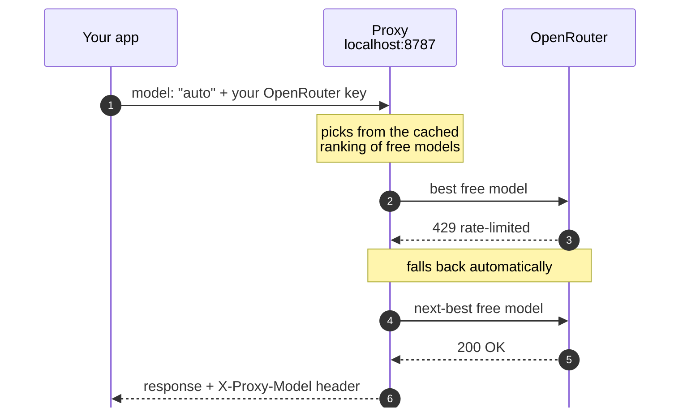
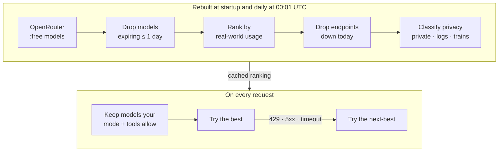

# openrouter-free-model-proxy

> [!NOTE]
> The general-purpose sibling of [hermes-openrouter-free-rotator](https://github.com/GoSlowPoke168/hermes-openrouter-free-rotator), synced with its ranking and privacy logic. PRs welcome.

`openrouter-free-model-proxy` acts as an automatic router and manager for free OpenRouter models so you never have to worry about getting rate-limited or remembering to switch to a different model after one expires. This proxy makes that entirely someone else's problem: point your app at it, send `model: "auto"`, and it always assigns you the best free model available — re-ranking automatically as the catalogue changes, and falling back instantly to the next-best model if the one it picked fails. No model names to update, no expiration dates to watch.

It's a small local proxy that is compatible with any LLM SDK like the OpenAI Python SDK. Any app in any language can use it — you keep using your own OpenRouter key, you just change the `base_url`.


```mermaid
%%{init: {"sequence": {"mirrorActors": false}}}%%
sequenceDiagram
    autonumber
    participant App as Your app
    participant P as Proxy<br/>localhost:8787
    participant OR as OpenRouter

    App->>P: model: "auto" + your OpenRouter key
    Note over P: picks from the cached<br/>ranking of free models
    P->>OR: best free model
    OR-->>P: 429 rate-limited
    Note over P,OR: falls back automatically
    P->>OR: next-best free model
    OR-->>P: 200 OK
    P-->>App: response + X-Proxy-Model header
```

## How it works


```mermaid
flowchart TB
    subgraph daily ["Rebuilt at startup and daily at 00:01 UTC"]
        direction LR
        A["OpenRouter<br/>:free models"] --> B["Drop models<br/>expiring ≤ 1 day"] --> C["Rank by<br/>real-world usage"] --> D["Drop endpoints<br/>down today"] --> E["Classify privacy<br/>private · logs · trains"]
    end
    subgraph request ["On every request"]
        direction LR
        F["Keep models your<br/>mode + tools allow"] --> G["Try the best"] -->|"429 · 5xx · timeout"| H["Try the next-best"]
    end
    daily -- "cached ranking" --> request
```

Errors no other model could fix (bad key, no credits) come straight back to you — see [errors](#errors).

## Install

One line (clones to `~/openrouter-free-model-proxy`, runs it as a background service):

```bash
curl -fsSL https://raw.githubusercontent.com/GoSlowPoke168/openrouter-free-model-proxy/main/install.sh | bash
```

Or manually:

```bash
git clone https://github.com/GoSlowPoke168/openrouter-free-model-proxy
cd openrouter-free-model-proxy
python3 -m venv venv && ./venv/bin/pip install -r requirements.txt
./run_proxy.sh                 # foreground, or:
./install_service.sh           # background systemd --user service (survives logout)
```

Requires `python3` + `git`. Only dependency: `requests`. Set `NO_SERVICE=1` before the one-liner to skip the service.

**Service name:** `openrouter-free-model-proxy` (systemd `--user` unit). Useful commands:

```bash
systemctl --user restart openrouter-free-model-proxy   # reload after a config/code change
systemctl --user status openrouter-free-model-proxy
journalctl --user -u openrouter-free-model-proxy -f    # tail logs
```

### Windows

```powershell
irm https://raw.githubusercontent.com/GoSlowPoke168/openrouter-free-model-proxy/main/install.ps1 | iex
```

Installs to `~\openrouter-free-model-proxy` and starts it in the background at every logon (scheduled task `openrouter-free-model-proxy`, no console window). Logs go to `~\.cache\openrouter-free-model-proxy\proxy.log`. Same `DEST` / `REPO` / `NO_SERVICE` overrides, set as `$env:NO_SERVICE = "1"`.

```powershell
Stop-ScheduledTask openrouter-free-model-proxy; Start-ScheduledTask openrouter-free-model-proxy   # restart after a config change
Unregister-ScheduledTask openrouter-free-model-proxy -Confirm:$false                            # remove
```

## Use

Point your client at the proxy and send `model: "auto"`:

```python
from openai import OpenAI
client = OpenAI(base_url="http://127.0.0.1:8787/v1", api_key="<your OpenRouter key>")
client.chat.completions.create(model="auto", messages=[{"role":"user","content":"hi"}])
```

```bash
curl http://127.0.0.1:8787/v1/chat/completions \
  -H "Authorization: Bearer $OPENROUTER_API_KEY" \
  -d '{"model":"auto","messages":[{"role":"user","content":"hi"}]}'
```

The proxy forwards your key straight to OpenRouter (it stores nothing and never logs your key). Add `"stream": true` for token streaming. The response header `X-Proxy-Model` tells you which model actually answered (`X-Proxy-Fallback: true` if it wasn't the first pick).

### Privacy tiers

OpenRouter's free endpoints aren't all the same deal — each one is classified into one of three data-policy tiers:

| tier | what it means for your prompts |
|---|---|
| **private** | not used for training, not retained/logged |
| **logs** | not used for training, but retained/logged (e.g. for abuse monitoring) |
| **trains** | may be used to train future models |

### Modes

A mode picks which tiers can be auto-selected (a model with an unknown tier never is). Default: `defaults.mode` in config.

| mode | tiers | order |
|---|---|---|
| `strict` | private | rank |
| `balanced` *(default)* | private, logs | all `private` before any `logs` |
| `relaxed` | private, logs | best rank wins |
| `loose` | private, logs, **trains** | best rank wins |

### Model strings

| value | behaviour |
|---|---|
| `auto` | best free model right now, under the default mode |
| `auto:strict`, `auto:relaxed`, … | pick a mode (old `auto:private` / `auto:logs` / `auto:any` still work) |
| `auto:tools` / `auto:notools` | require / don't require tool-calling support |
| `auto:tools,strict` | combine flags |
| `smart`, `fast` | your own aliases (see config) |
| `vendor/model` | that exact model, passed through unchanged (free or paid) |
| `vendor/model,auto` | that model, falling back to `auto` (or `auto:<flags>`) if it fails |
| any other name without a `/` | treated as `auto` |

Unknown flags are a 400. Headers work too: `X-Proxy-Privacy: <mode>`, `X-Proxy-Require-Tools: true`; a `tools` array implies tool support.

### Errors

- **Bad key, no credits, moderation** (401/402/403) → OpenRouter's error is returned immediately; no other model would help.
- **Anything else** (rate limit, outage, timeout, invalid/removed model) → tries the next model. If every model fails the same way, you get OpenRouter's own error; otherwise a `502`.
- **Streaming** can fall back until the first token is sent, not after.

### Endpoints (no key needed except the completion)

| method | path | what |
|---|---|---|
| POST | `/v1/chat/completions` | the proxy (needs your key) |
| GET  | `/models` | ranked free models with tier / uptime / tools / reason |
| GET  | `/v1/models` | same list, OpenAI `{data:[{id}]}` shape |
| GET  | `/status` | cache age + current top pick |

```bash
curl http://127.0.0.1:8787/models              # browse the ranked free models
curl 'http://127.0.0.1:8787/models?tools=1'     # only tool-capable
curl 'http://127.0.0.1:8787/models?mode=loose'  # rank under another mode (any=1 still works)
curl 'http://127.0.0.1:8787/models?refresh=1'   # force a fresh scrape
```

## Configure — `config.json`

Values here are **defaults**; a request can override them per-call — unless the policy is in `locked`, then requests can only make it stricter, never looser.

```json
{
  "host": "127.0.0.1",
  "port": 8787,
  "ttl_seconds": 86400,         // on-demand safety net only — see daily_refresh_at
  "daily_refresh_at": "00:01",  // HH:MM UTC the ranked list is rebuilt
  "cascade_depth": 5,           // models to try before giving up
  "request_timeout": 120,
  "defaults":  { "require_tools": false, "mode": "balanced" },
  "locked":    [],              // e.g. ["mode"] so no request can pick a looser mode
  "denylist":  { "models": [], "providers": [] },   // drop these from the cascade
  "aliases":   { "smart": "auto:strict", "fast": "auto" },
  "last_resort_model": null     // null → return 503 when no free model qualifies
}
```

- **denylist** — exclude specific models or endpoint-providers (e.g. `"providers": ["Google AI Studio"]` to avoid free endpoints backed by an already-rate-limited upstream).
- **locked** — `"mode"` / `"require_tools"`: requests can tighten them, never loosen.
- Old `require_private` / `allow_trains` configs still work (→ `strict` / `loose`).
- **last_resort_model** — off by default (so it's always $0); set a paid model to avoid a hard 503 when no free model is healthy.

## Scope

`POST /v1/chat/completions` only (no legacy completions/embeddings yet). Binds localhost by default; widen `host` at your own risk (no TLS built in). Billing is whatever OpenRouter tracks against the key you send. The ranking/privacy logic is lifted from the sibling project [`hermes-openrouter-free-rotator`](https://github.com/GoSlowPoke168/hermes-openrouter-free-rotator).

## Codebase

```
install.sh          internet installer (clone → venv → service)
install.ps1         same for Windows (clone → venv → scheduled task)
install_service.sh  register the systemd --user service
run_proxy.sh        run the server directly
proxy.py            HTTP server: routing, pass-through auth, cascade, streaming
ranker.py           builds + caches the ranked free-model list (the "brain")
selection.py        pure ranking + privacy-tier logic
openrouter.py       unauthenticated OpenRouter data fetchers
config.json         defaults / policies / denylist / aliases
tests/              pytest suite (pip install -r requirements-dev.txt; python -m pytest)
```
